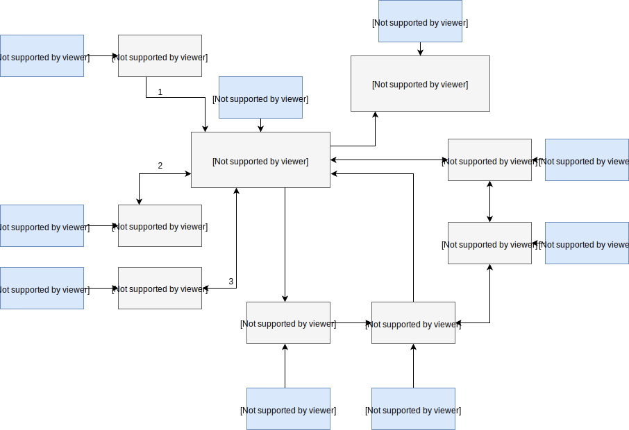

# 2º Projeto de Introdução à Computação 2017/2018

* Diogo Martins - a21701345
* Francisco Freixo - a21701661
* Rui Martins - a21701462

## Our solution

### Architecture

For our game we tried to split different mechanics into different files.
Every file has its own `.h` where we store structures and functions prototypes.

The main program is `example.c` in which we basically get the configuration variables from the configuration file using `read_from_config.c` and use them to spawn all the agents randomly across the grid. `agent.c` is used to create/destroy the agents that will populate the grid. `shuffle()` is called from `shuffle.c` to randomize agent playing order before each turn. We then check if the next agent playing is user controlled or not and if it is, we use `manual_move.c`, otherwise `neighborhood.c`is used to check for the nearest enemy and further call `AI_move.c`.

Each movement in the grid (be it actual agent movement or enemy checking) is verified with `toroidal.c` so that coordinates are never off bounds.

### Data structures

The mainly data structures that we use are arrays and structs. `agent_grid` for example holds all the positions of the grid (empty spaces and agents themselves).
We created an array of pointers to agents for the shuffle before each turn and also an `AGENT` struct that holds information such as the  `id`, `type`, `x` and `y` positions on grid, and more!

In the functions that we use to return coordinates, we used a struct that held `x, y` values so we could return both variables through it.

### Algorithms

**Toroidal algorithm:**

`position.x = (x + destination_x + WORLD_X) % WORLD_X;` and `position.y = (y + destination_y + WORLD_Y) % WORLD_Y;`

We developed this algorithm with the help of some extended research. We use it in a function that receives the actual agent position and where it wants to go to, and it basically never goes offgrid. It also works for the Moore verification. When radius and checks for enemies off grid, it will correctly enter through the other side of the grid and check correctly.

**Movement algorithm:**

`if ( abs(agents_array[position]->x - enemy_x) > r )` then walk in a certain direction depending the the final value is `< 0` or `> 0`.

We use this to verify if it is faster to reach or run from the enemy by crossing the grid to the other side or by walking back by comparing the distance between agents and the radius in which the enemy was found. `If distance > r then walk in a direction, otherwise walk the opposite way (depending if the agent is a Zombie or a Human.`

**Searching for other agents on grid (Moore Neighbourhood):**

`for radius = actual r until it reaches an agent or all grid cells`, use two for cycles to go through the squares surrounding our agent, for example:

If `radius` is 1 at the moment we are checking the 8 squares surrounding us, with:

`for destination_x = -r; dest_x <= r; dest_x++)` and inside the dx cycle: `for (dest_y = -r; dest_y <= r; dest_y++)`

This will allow us to go through `x, y =  -1,-1 / -1,0 / -1, 1 / 0, -1 / 0, 0 / 0, 1 / 1, -1 / 1, 0 / 1, 1` and it will increase as the radius increases!

## User guide

##### Game setup in 3 simple steps

**1st** - Open up your Linux Terminal and construct the build by running `make` while on the game folder.

**2nd** - Edit your config.INI file to setup the game settings (Number of turns, humans, zombies, playable agents, etc.)

**3rd** - Run the command ./example config.ini (config.ini is case sensitive!)

##### Game intructions

Our game is really simple. Zombies chase Humans while they run for their lives to try to stay alive.
You setup pretty much every number in the configuration file and while running the game, agents will be AI or manually controlled (depending on what you specify on the `config.ini` file).
Press `ENTER` to see the agent movements and when it is your time to play, choose a number from `1` to `8` to move your agent (it will be displayed in the screen a figure that shows you the directions of each one of the numbers).

Game ends when turns end or humans go extinct.

Have fun!

## Conclusions

By developing this game, not only did we expand our programming knowledge but we also had a lot of fun while doing it.

It was a very tough project that required countless hours of dedication. Most of the time was spent thinking of logical ways to do it and applying formulas.

Before starting, we made sure to structure well the program and try to do it piece by piece, and it eventually ended up filling the whole puzzle. Despite it taking a big part of our time, we couldn't be happier with the final result.
It is such a pleasure when your goals are accomplished and we think we have outdone ourselves with this one. Good job team!

## References

* <a name="ref1">\[1\]</a> Pereira, A. (2017). C e Algoritmos, 2ª edição. Sílabo.
* <a name="ref2">\[2\]</a> Reagan, P. (2014). [Game Programming in C with the
Ncurses Library](https://www.viget.com/articles/game-programming-in-c-with-the-ncurses-library),
Viget Labs.
* <a name="ref3">\[3\]</a> [2D game development basics (2010)](https://stackoverflow.com/questions/3144399/2d-game-development-basics),
stackoverflow.com
* <a name="ref3">\[4\]</a> [Moore Neighbourhood](https://pdfs.semanticscholar.org/2a83/949bdf95186d041af2271f9b5a65986a9b26.pdf), semanticscholar.org

## Collaborators

We would like to thank our classmate Nuno Carriço for all the help that he provided us. Our communication and mutual aid was crucial to the outcome
of this project.

* <a name="ref1">\[1\]</a> [Nuno Carriço](https://github.com/NunoCarrico98)
